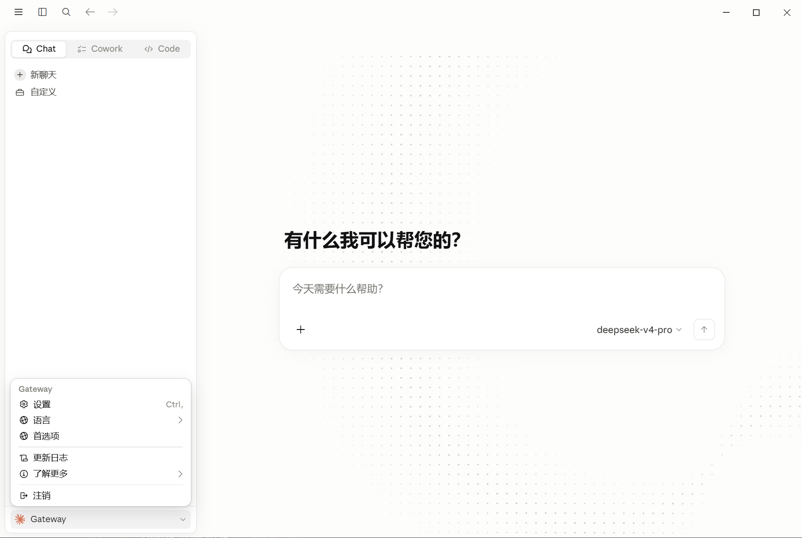
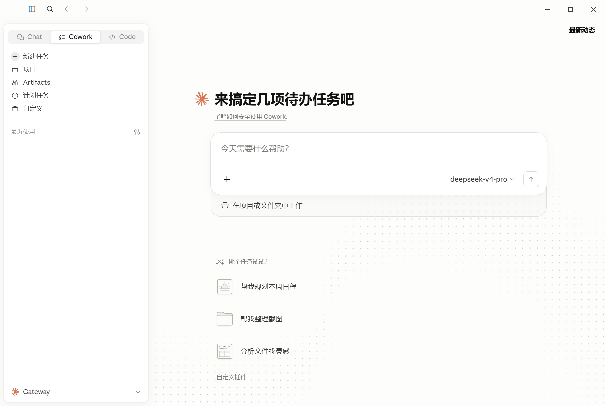
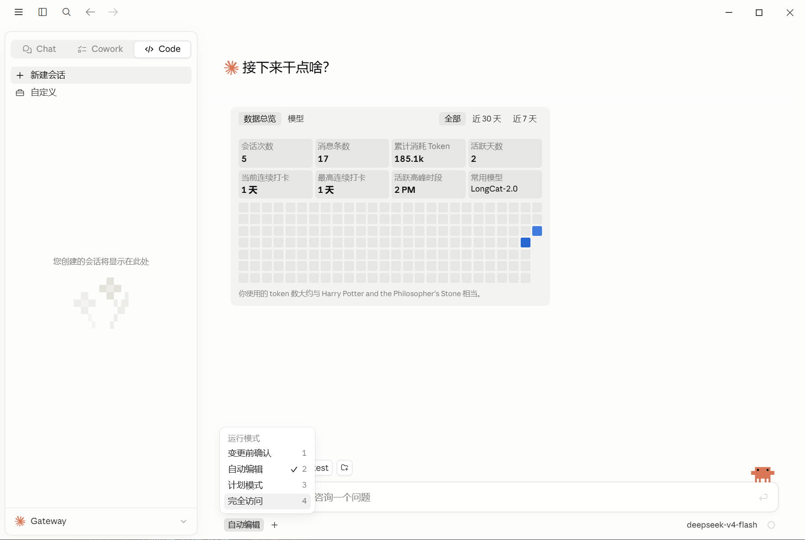
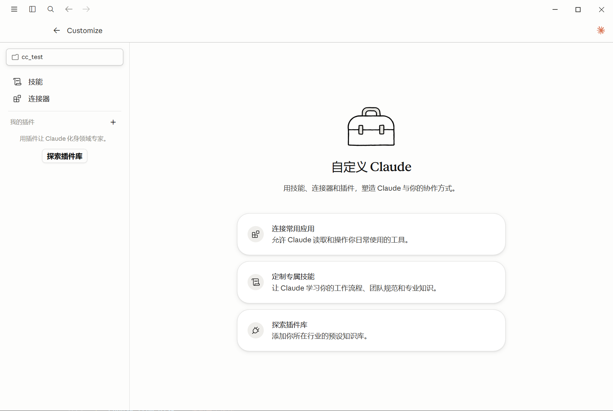
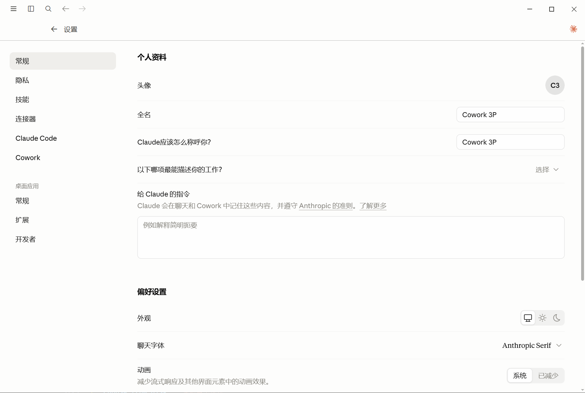
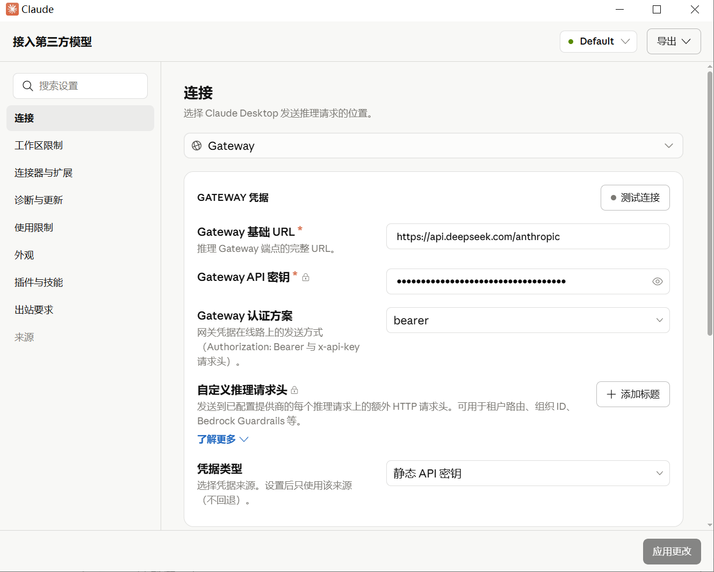

# 2026年8月17日

项目归档，最新版的Claude Desktop 这种替换方式失效了，暂未找到解决办法

其次，Deepseek DSH 发布，不折腾这个了

# Claude Desktop 轻量汉化脚本

这是一个只替换 Claude Desktop 本地英文资源 JSON 的轻量脚本。直接将EN.json资源替换成CN.json资源，不对程序其他文件进行任何修改。

其他方案有点复杂，所以有了本项目。与其他项目区别，汉化更全，改动更小，更轻量。自动适配最新版本。

记忆库18484条翻译，里面的有些翻译可能不太合适，因为没有具体的界面信息。如果发现哪里翻译不通顺，欢迎各位进行提交 issue 或者 PR，共建翻译记忆库

目前只适配了 Windows ,欢迎有 Mac 的同学进行适配，PR。

## 使用流程

1. 退出 Claude Desktop。
2. 运行 `install-windows.bat`，按提示授予管理员权限。
3. 脚本启动时会先检查更新：
   - 工具有新版本：提示去 GitHub/Gitee 下载最新版；用户也可以继续使用旧版，但建议使用新版。
   - 记忆库有新版本：自动下载新的 `translation_memory.json` 并更新本地 `version.json`。
   - GitHub 超时或失败时会尝试 Gitee；都失败时继续使用本地记忆库。
4. 菜单中选择 `3. 使用记忆库汉化`。

PS：每次 Claude Desktop 更新后，只需要运行一下本程序即可。随时适配最新版本。

**PS：汉化工具不会自己更新，需要大家手动下载项目，如果已经翻译过当前版本，直接覆盖即可原文件夹即可。**

## 部分截图













## 文件

- `translation_memory.json`: 翻译记忆库，格式为 `{"英文": "中文"}`。
- `version.json`: 本地版本信息，包含 `windows_tool` 和 `translation_memory`。
- `install-windows.bat`: 交互入口，双击运行即可。
- `scripts/claude-desktop-zh-simple.ps1`: 实际执行脚本。
- `backups/<Claude版本号>/original/`: 自动保存该 Claude 版本的原始英文资源备份。
- `reports/<Claude版本号>/`: 汉化报告和缺失翻译清单。
- `state/<Claude版本号>.json`: 本机状态文件，记录该版本当前是未汉化、已汉化还是已还原。

## 初次使用和二次使用

初次使用时，Claude Desktop 里的英文资源还没有被替换。脚本会先按当前 Claude 版本号备份 3 个原始英文资源文件到 `backups/<Claude版本号>/original/`，然后生成中文资源并覆盖。

Claude Desktop 更新后，WindowsApps 里的版本目录会变化，之前的汉化会被 Claude 更新覆盖。重新运行本工具即可：脚本会识别新的 Claude 版本号，为新版本重新备份，再重新汉化。

如果同一个 Claude 版本已经有备份，再次汉化时会优先使用该版本的 `original` 英文备份作为源文件重新生成中文资源。这样更新记忆库后可以直接重复汉化，不需要手动还原英文。

脚本不会覆盖已有的原始英文备份。如果当前状态已经是“已汉化”，手动执行备份也不会把中文资源覆盖成原始备份。

`manifest.json` 和 `state/<Claude版本号>.json` 中保存的是项目内相对路径。移动整个工具目录后，备份和状态仍然可以被识别。


## 菜单

- `1. 查看状态`: 查看 Claude 版本、资源路径、备份状态和预计可替换数量。
- `2. 备份当前 Claude 资源`: 手动备份当前 3 个资源文件。
- `3. 使用记忆库汉化`: 备份并替换资源文件。
- `4. 从备份还原`: 将当前 Claude 版本恢复到备份资源。
- `5. 导出缺失翻译清单`: 导出记忆库未命中的英文文本。
- `6. 检查更新/更新记忆库`: 手动重试工具和记忆库版本检查。

脚本会处理这 3 个文件：

```text
app\resources\en-US.json
app\resources\ion-dist\i18n\en-US.json
app\resources\ion-dist\i18n\dynamic\en-US.json
```

## 命令行用法

也可以直接运行 PowerShell：

```powershell
powershell.exe -NoProfile -ExecutionPolicy Bypass -File .\scripts\claude-desktop-zh-simple.ps1
```

非交互示例：

```powershell
powershell.exe -NoProfile -ExecutionPolicy Bypass -File .\scripts\claude-desktop-zh-simple.ps1 -Action status
powershell.exe -NoProfile -ExecutionPolicy Bypass -File .\scripts\claude-desktop-zh-simple.ps1 -Action patch -Yes
powershell.exe -NoProfile -ExecutionPolicy Bypass -File .\scripts\claude-desktop-zh-simple.ps1 -Action restore -Yes
powershell.exe -NoProfile -ExecutionPolicy Bypass -File .\scripts\claude-desktop-zh-simple.ps1 -Action update
```

## 权限说明

WindowsApps 目录默认受保护。脚本会对目标资源文件执行 `takeown`、`icacls` 和取消只读属性，以便修改 Claude Desktop 的资源文件。恢复时同样会先处理权限再复制备份文件。

本项目不会修改 `app.asar`，不会新增中文语言选项，只是直接把英文资源文件的值替换为中文。


## 鸣谢

Claude Desktop 中文补丁：https://github.com/javaht/claude-desktop-zh-cn

本项目的基础翻译库，1万条左右，来此次项目，感谢作者贡献。后面7000多条是作者自己翻译的，应该比较全。

Claude Desktop zh-CN for Windows：https://github.com/chrichuang218/claude-desktop-zh

这是一个带GUI界面的自动化工具，给本项目带来了灵感。鸣谢！

🙏 感谢 [LINUX DO](https://linux.do) 社区的支持与讨论。

## 其他

开源地址：

- GitHub: <https://github.com/GMYXDS/claude-desktop-zh-simple>
- Gitee: <https://gitee.com/GMYXDS/claude-desktop-zh-simple>

声明：本工具永久免费，请勿从任何倒卖、收费渠道购买。